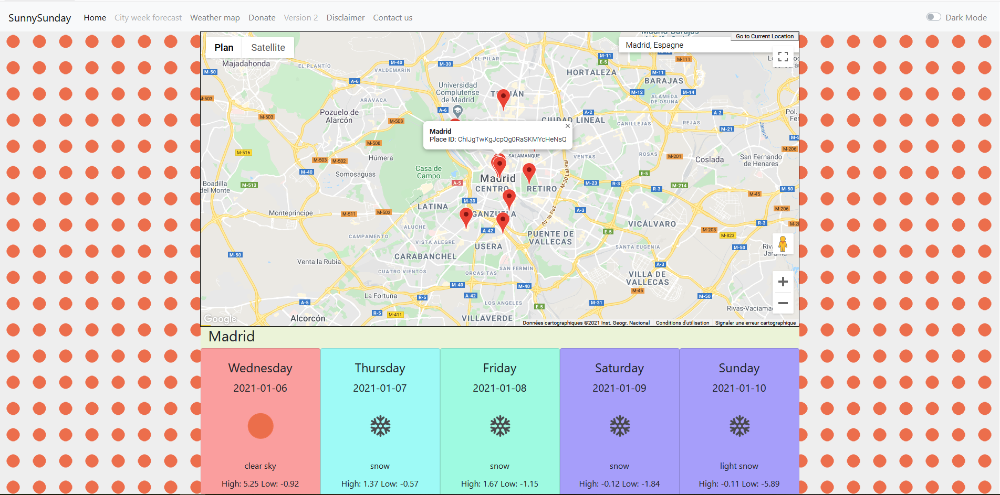

# SunnySunday

SunnySunday is a weather website using Google Maps and Openweathermap data to let people find best places to visit in their entourage; For warmer winter weather vacation or cool summer escapes. 

It is a NodeJs & Express web app with other dependencies (axios, redis, reverse-geocode, nearby-cities, openweather-apis...).

# Deployment

- Replace Google Map and Openweathermap API keys with yours. Don't forget to set origins in your cloud accounts. Search for YOUR_GOOGLEMAPS_API_KEY and YOUR_OPENWEATHERMAP_API_KEY.
- Install and run Redis server.
- Configure .env file with the followings:
    - NODE_ENV=development
    - NODE_PORT=####
    - REDIS_PORT=####
    - OPENWEATHERMAP_API_KEY=YOUR_OPENWEATHERMAP_API_KEY
    - GOOGLE_MAPS_API_KEY=YOUR_GOOGLEMAPS_API_KEY

Then run:

`npm install` which installs dependencies.

`npm start` which starts at port 3000 normally.

# A Glimpse of UI

Note I really want just a one page for this one web app.

# Contribution

Please see open issues for a specific issue, and do not hesitate to open any new issue (like better code, readability, modularity and best practice, performance, better UI or even functionality enhancements...).

Current priority: 

https://github.com/bacloud14/SunnySunday/issues/1

Please know that I am not a keen NodeJS developer, but I successfully made this weather application. It is in its early stage and not proper for final service yet.

If you contribute, please consider that I can merge and publish a new release under one channel or another. It will be 100% free although I can add ads to generate some coffee expenses :)

If you want to maintain the project with me; You can alwayse ask.

Please keep it fair if you want to deploy anywhere; Ask for permission.

Sweet coding !
